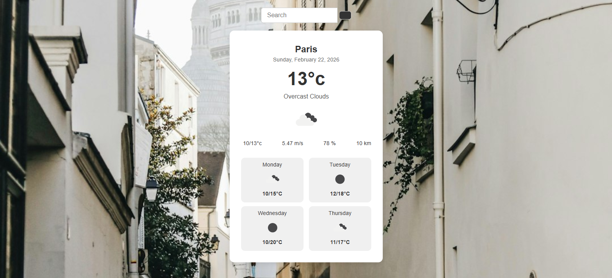

# Weather App – Learning Project

This is my first small weather app project, built as part of my personal learning journey with **Node.js** and front-end development. The app fetches weather data from OpenWeatherMap and displays a 5-day forecast for any city the user searches for.  

> **Note:** This project is primarily a record of my learning process. With hindsight, the JavaScript structure could be improved, especially around data handling and code organization. It’s not intended as production-ready code, but as a reflection of my growth in programming.

## Features

- Search for any city to see its current weather and 5-day forecast.
- Displays temperature, humidity, wind speed, visibility, weather description, and corresponding icons.
- Responsive design for desktop and mobile.

## Demo

You can view the live app on GitHub Pages here:  
[Weather App Live](https://alizee-dev.github.io/Weather-app/)

## Screenshot

## Learning Outcomes

- Understanding asynchronous data fetching with `fetch()` in JavaScript.
- Working with APIs (OpenWeatherMap).
- DOM manipulation to dynamically display data.
- Basic responsive design using CSS.
- Handling user input and event listeners.
- Reflecting on code structure and planning improvements for future projects.

## Notes

This project serves as a **learning milestone**. I am aware there are improvements to be made:

- Refactor JavaScript to better separate concerns and avoid repeated logic.
- Improve handling of daily forecasts and calculations (min/max temperatures, descriptions).
- Consider more elegant error handling for API failures.

> Built as part of my learning journey in web development. This repository is a record of practice and progress, not a polished production app.
